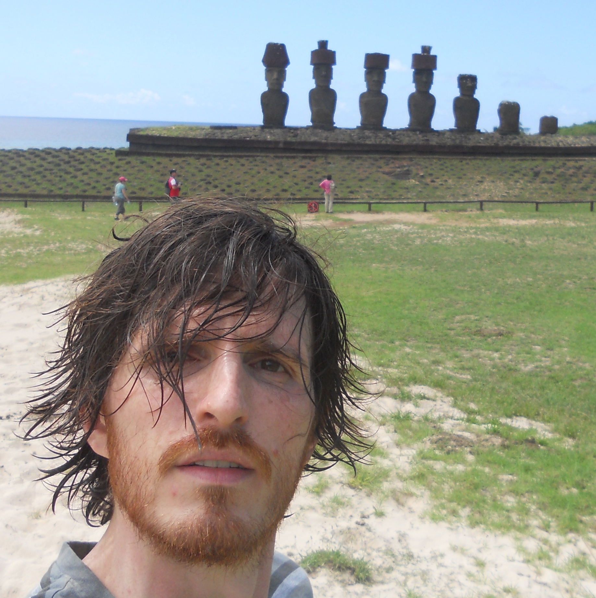

## Damiano Testa

 [`mathlib`](https://github.com/leanprover-community/mathlib4)

I am a Reader in the [Mathematics Institute](https://warwick.ac.uk/fac/sci/maths/) of the [University of Warwick](https://warwick.ac.uk/insite/).
Prior to coming here, I was in the mathematics departments of
[Oxford](https://www.maths.ox.ac.uk),
[Bremen](https://math.constructor.university/),
[Roma](https://www.mat.uniroma1.it/),
[Ithaca](https://math.cornell.edu/),
[Boston](https://math.mit.edu/index.php),
[Roma](https://www.mat.uniroma1.it/).
My PhD supervisor was
[Johan de Jong](https://www.math.columbia.edu/~dejong/);
my undergraduate supervisor was
[Corrado De Concini](https://en.wikipedia.org/wiki/Corrado_de_Concini).
You can find a copy of my CV [here](pdfs/CV.pdf).

Between July 2025 and July 2027 I am partially supported by the [AI for Math Fund](https://www.renaissancephilanthropy.org/ai-for-math-fund) award [Bridging proof and computation](https://www.renaissancephilanthropy.org/bridging-proof-and-computation-a-verified-leanmacaulay2-interface).

Between September 2013 and August 2015 I was partially supported by the EPSRC grant [Moduli Spaces and Rational Points](msrp/).

> _"... most of the statements we made were wrong, most of the facts we learned were trivial..."_

---

#### Contact Information

  <!-- Left column: email, office, phone, fax -->
  

    <b>Email:</b> d.testa at warwick dot ac dot uk 
    <b>ORCID:</b> <a href="https://orcid.org/0009-0004-5949-6861">0009-0004-5949-6861</a> 
    <b>arXiv:</b> <a href="https://arxiv.org/a/testa_d_1.html">testa_d_1</a> 
    <b>Office:</b> C2.13, Zeeman Building 
    <b>Phone:</b> +44 (0)24 765 22662 
    <b>Fax:</b> +44 (0)24 765 24182 
  

  <!-- Right column: postal address -->
  

    <b>Address:</b> 
    Mathematics Institute 
    University of Warwick 
    Coventry, CV4 7AL 
    United Kingdom
  

---
